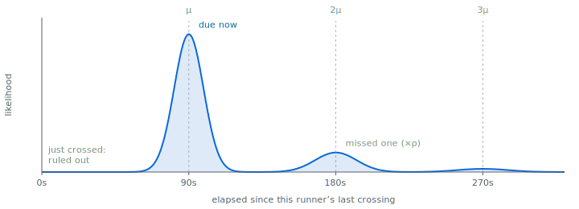

# Visual Race Timing

Time runners' laps based on a video. Originally built for Race Condition
Running's [Drumheller Marathon 2024](https://raceconditionrunning.com/drumheller-marathon-24) event. Code based
substantially on Ultralytics and yolo_tracking codebases, from which we inherit the AGPL License.

* Annotation GUI for marking runners crossing the line
* Runner detection to reduce the number of frames that need to be examined
* Runner re-identification to help you keep track of who's who
* Lap time collation and results output

## Installation

This project uses [uv](https://docs.astral.sh/uv/) for dependency management. Install locally with:

```
uv sync
```

Run scripts with `uv run <script>.py`, or activate the environment via `uv venv`/`source .venv/bin/activate`.

## Usage

1. Record a video of the lap line. The video needs to have timecode metadata
2. Run a detector over all frames (`detect.py`)
3. Create an event configuration file (`config.yaml`)
4. Annotate crossings (`annotate.py`)
5. Collate the results (`collate.py`)

Each of these scripts work on a _project_ directory, which directions with configuration, detection, and annotation
files. The project directory is specified as the first argument to each script.

### Recording a video

Aim for an elevated, static perspective of the finish line. 30fps/1080p is passable, but you need 4k for ReID to work (you want at least 200 x 100 pixel human bounding bounding boxes).

The video needs to have start timecode metadata set to a global reference. Frame numbers in this timecode are used to
key detections and annotations.

### Running the detector

Use the `detect.py` script to run the detector over all frames of the video. The script dumps out a file per frame with
YOLO-format detections (class, x, y, w, h, confidence), normalized as a fraction of frame dimensions. Use the largest
version of YOLO that you can run in a reasonable amount of time. The `--conf` flag sets the confidence threshold for
detections and needs to be manually tuned for your video.

* You should specify a crop (`--crop`) region around the finish line, as there's no need to detect runners outside of
  this area.
* `--device` accepts anything Ultralytics' device selection understands: `cuda`, a GPU index like `0`
  or `0,1,2,3`, `cpu`, or `mps` for Apple Silicon.

### Creating an event configuration file

Create a `config.yaml` file in the project directory. This file contains the event configuration, including the
participants, the finish line, and the start times. The `config.yaml` file is a dictionary with the following keys:

| Key                   | Description                                                                                                                                                                                                                                                                                                                                                                                                                             |
|-----------------------|-----------------------------------------------------------------------------------------------------------------------------------------------------------------------------------------------------------------------------------------------------------------------------------------------------------------------------------------------------------------------------------------------------------------------------------------|
| participants          | Dictionary with bib number key to runner name value                                                                                                                                                                                                                                                                                                                                                                                     |
| finish_line           | Tuple of two points for finish line pixels [[x0, y0], [x1, y1]]. Get these points with `scripts/get_point_in_video.py`                                                                                                                                                                                                                                                                                                                  |
| starts                | Dict with named starts (e.g. 'marathon', 'half'), where values are dicts with keys `time` (timecode string) and either `bib_range` (half-open `[lo, hi)` tuple of bibs) or an explicit `bibs` list. `bibs` wins if both are given. An optional per-start `start_distance` (course distance already covered at that start, e.g. for a wave joining partway through) is forwarded into `results.json` but isn't used by collation itself. |
| exclude               | List of bibs to omit from `collate.py`'s report/`results.json` output                                                                                                                                                                                                                                                                                                                                                                   |
| lap_distance          | Distance covered by one lap. Forwarded into `results.json`; not used by collation itself.                                                                                                                                                                                                                                                                                                                                               |
| goals                 | Dict per start name mapping milestone labels (e.g. `5k`, `13_1mi`) to the lap number at which that distance is reached. Forwarded into `results.json`; not used by collation itself.                                                                                                                                                                                                                                                    |
| first_lap_is_entrance | Whether the first recorded "lap" is the entrance onto the course rather than a full lap. Forwarded into `results.json`; not used by collation itself.                                                                                                                                                                                                                                                                                   |
| direction_starts / directions | Parallel lists of timecodes and course directions (`CW`/`CCW`) for courses that alternate direction over time. Forwarded into `results.json`; not used by collation itself.                                                                                                                                                                                                                                                             |

### Annotating crossings

Annotations are human-verified markings of where in a frame a runner was (bounding box) and whether they crossed the
line in the frame. They are persisted in an `annotations.db` SQLite database in the project directory. The `annotate.py` script is a video player GUI which allows you to create and edit these annotations. The
workflow is to scrub through detections, promoting them to annnotations as needed, and then to mark the annotations as
crossing or not crossing the line. Detections do not have an identifying number, so the tool will request input for the
runner ID. As you mark more annotations, the tool will attempt to re-identify runners based on their visual features.
The re-identification model runs on boxmot's ReID backend. Point `--reid-model` at a name boxmot recognizes, such
as `osnet_ain_x1_0_msmt17.pt`, and it will be auto-downloaded on first use; otherwise place a checkpoint (e.g. from the
[torchreid model zoo](https://kaiyangzhou.github.io/deep-person-reid/MODEL_ZOO.html)) at `data/` yourself. We used
`osnet_ain_x1_0` trained on MSMT17 for cross-domain re-identification.

#### The timing prior

Appearance isn't the only clue to who just crossed: a runner's lap history says a lot about whether they're plausibly
crossing *now*. Someone who crossed 10 seconds ago almost certainly isn't; someone whose laps run ~90s and who last
crossed ~90s ago very likely is.

For each candidate, the tool estimates their lap time `mu` from their own previous laps (recent laps weighted most, so
it tracks fatigue; shrunk toward the field average when they have few laps) and scores the time elapsed since their last
crossing against it. Because crossings get missed, the score is a mixture over "this is their next lap", "they missed
one", and so on, each successive miss discounted by a factor `rho`:



Only crossings *before* the current frame are used, so the prior sees exactly the history you've annotated so far. It's
combined with the ReID appearance distance to re-rank the candidate list the tool suggests — you still see the
appearance confidence, only the ordering reflects timing. Runners with no history yet fall back to the field-average lap
and neither win nor lose ground.

#### Commands

While the GUI window has focus, you can use the following keyboard commands:

| Input                                | Action                                                                             |
|--------------------------------------|-------------------------------------------------------------------------------------|
| `left click` on detection            | Promote detection to annotation                                                     |
| `left click` on annotation           | Begin edit (CLI prompt for command)                                                 |
| `left click` + `shift` on detection  | Promote detection to annotation crossing                                            |
| `left click` + `shift` on annotation | Mark annotation as crossing                                                         |
| `left click` + `ctrl` on annotation  | Mark annotation as crossing and reassign runner ID, propagated to nearby frames (via CLI) |
| `right click` -> drag -> release     | Create annotation with start and end corners                                        |
| `e`                                  | Begin edit (CLI prompt for command) on an annotation in the current frame           |
| `d`                                  | Delete annotation (via CLI prompt for runner ID)                                    |
| `D`                                  | Delete annotation, propagated to nearby frames (via CLI prompt for runner ID)        |
| `c`                                  | Mark/unmark annotation as crossing (via CLI prompt for runner ID)                   |
| `r`                                  | Reassign runner ID (via CLI prompt for runner ID)                                    |
| `R`                                  | Reassign runner ID, propagated to nearby frames (via CLI prompt for runner ID)       |
| `[` or `]`                           | Prev/next annotation                                                                 |
| `{` or `}`                           | Prev/next crossing annotation                                                        |
| `9` or `0`                           | Prev/next detection overlapping finish line                                         |
| `(` or `)`                           | Prev/next frame                                                                      |
| `s`                                  | Seek to timecode (via `HH:MM:SS` CLI input)                                          |
| \`                                   | Create note annotation (via CLI)                                                     |
| `Backspace`                          | Jump backward 10s                                                                    |
| `Delete`                             | Jump forward 10s                                                                     |
| `Space`                              | Pause/Play video                                                                     |
| `+` or `-`                           | Increase/decrease playback speed                                                     |

Notes can be arbitrary text and are saved in the `annotations.db` database alongside the annotations. They are useful
for marking things that _didn't_ happen, like a runner not crossing the line. They will be printed out in the
collated lap time tables to help you check your work.

### Collating the results

The `collate.py` script prints lap time tables and a results.json file.

The results object has a `config` key which contains the race configuration, and a `results` key, which contains a list
of dictionaries with the following keys:

* `id`: Runner bib
* `name`: Runner name
* `lap_times`: Floating point number of seconds for each lap (defined as crossing the line to crossing the line)

## Misc scripts

* `scripts/get_point_in_video.py`: Get a pixel coordinate in a video by clicking on it. Useful for making the finish
  line config.
* `scripts/render_video.py`: Trim/concatenate source video(s) into a single re-encoded file with timecode burned in.

## Future work

* Integrate partial GPS track data
* Use pose estimation to automatically mark crossings
* Fix up tracking (partially integrated in `annotate.py`, and `track.py` is a WIP)
